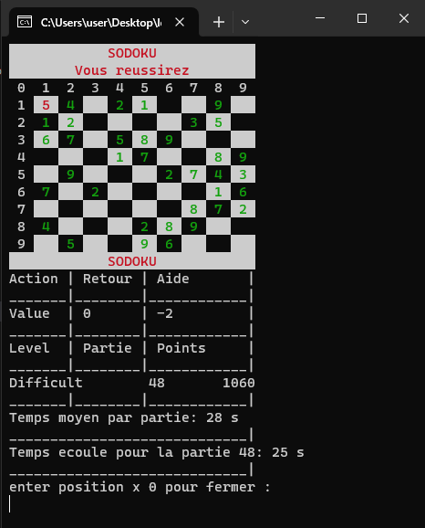
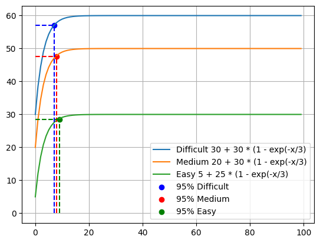
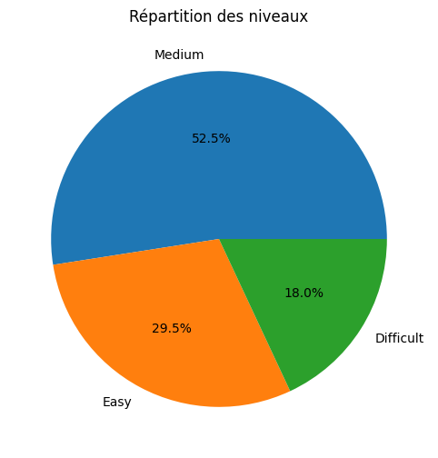
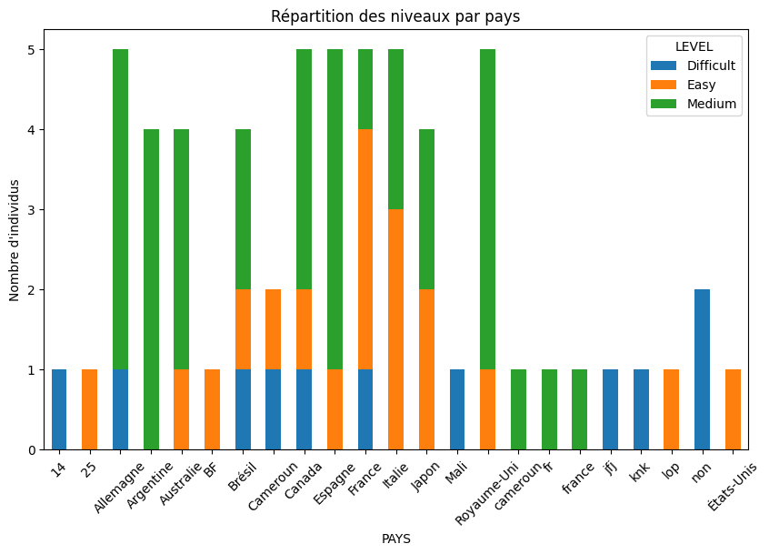

# SodokuGAME

Sodoku est un jeu de chiffres sur une grille 9x9. L'objectif : remplir la grille sans répéter les chiffres dans les lignes, colonnes et sous-grilles de 3x3.

Le jeu Sodoku est un casse-tête numérique populaire qui se joue sur une grille de 9x9 cases, divisée en neuf sous-grilles de 3x3 cases. L'objectif du jeu est de remplir toutes les cases de la grille avec des chiffres de 1 à 9 de manière à ce que chaque ligne, chaque colonne et chaque sous-grille de 3x3 ne contienne jamais deux fois le même chiffre. En d'autres termes, chaque chiffre de 1 à 9 doit apparaître une seule fois dans chaque ligne, chaque colonne et chaque sous-grille.

Le jeu commence généralement avec quelques chiffres déjà placés dans la grille, formant un puzzle initial. Le joueur doit ensuite utiliser la logique et l'élimination pour déterminer quels chiffres doivent être placés dans les cases vides pour résoudre le puzzle. Le jeu Sodoku est un défi de réflexion et de résolution de problèmes qui repose sur la logique et la perspicacité.

# Les objectifs du jeu Sodoku sont les suivants :
1. Remplir la grille de 9x9 avec des chiffres de 1 à 9 de manière à respecter les règles de non-répétition dans les lignes, les colonnes et les sous-grilles.
2. Résoudre le puzzle en déterminant les chiffres manquants de manière logique, sans deviner.
3. Compléter la grille de manière efficace en minimisant le nombre d'erreurs.
4. Améliorer ses compétences en résolution de problèmes et en logique pour résoudre des Sodokus de niveaux de difficulté croissants.

# resources
[1) wikipedia](https://fr.wikipedia.org/wiki/Math%C3%A9matiques_du_sudoku)

[2)Théorie des ensembles appliquée au sudoku et algorithmique associée
Marie-Pierre Falissard, professeure de mathématiques à Pully-Lausanne (collège Champittet)](https://www.vsmp.ch/crm/articles/articles_bulletin/B120_MPF.pdf)

# Demo :

# Gestion des niveaux

